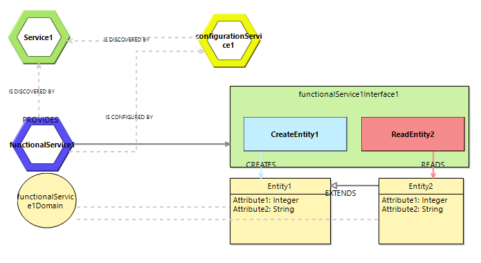

# AjiL
This repository is home of the Aji Modeling Language (AjiL). AjiL is a modeling language and  supportive tool to describe and create Microservice Architecture (MSA).

## The Modeling Language

As a modeling language, AjiL comprises three components: (i) Abstract syntax, (ii) Concrete syntax, and (iii) Semantics. They can be found as the ajil project 

### Abstract Syntax/Metamodel

*Figure 1: AjiL Metamodel*

As depicted in figure 1, starting from the system as the root element, a MSA consists of several microservices which can
be classified as functional or their infrastructural purpose. Each service consists of a domain
model, which aggregates multiple entities, and one or more interfaces. In AjiL, interfaces can
provide abilities, e.g. create or read, to manipulate entities of a service and thus are used to describe the endpoint of a service. In addition to the multiplicities shown in the figure, the abstract syntax comes with several constraints, e.g. to conceal entity relations to a single service. The constraints form AjiL's syntactical semantics and are formulated in the Object
Constraint Language (OCL). The constraints are detailed as follows.
* Unique names for the classes `Microservice`, `Interface`, `Domain Model`, `Ability`
* Unique ports for each service
* `Entities` are only allowed to inherit from `Entities` of the same `Domain Model`
* `Entities` are only allowed to relate to other `Entities` of the same `Domain Model`  
* Prohibition of self-relations for `Entities`
* Functional services are not allowed to depend on themselfs

### Concrete Syntax

*Figure 2: Notation Example*

AjiL's concrete syntax, exemplified in figure 2, can be characterized as a Box-and-Line diagram type. It uses uses shapes and colors to distinguish between the different language elements. 

## Corresponding tools

To create and work with AjiL models to support MSA developement, the modeling language comes with an editor and a code generator.

### Editor
For creating AjiL diagrams, AjiL comes with an editor which is realized using the [Eclipse Sirius
Framework](https://projects.eclipse.org/projects/modeling.sirius).

### Generator
At last, AjiL as a tool comprises a template-based generator realized with the [Epsilon
Generation Language (EGL)](https://eclipse.org/epsilon/). The generator is able to convert *.ajil model files to runnable microservices which rely on Spring Boot.

## Installation

## Usage

## Contact and Acknowledgement

