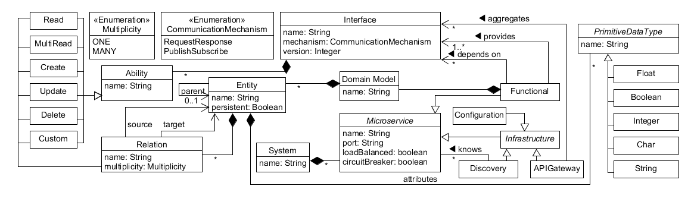

# AjiL
This repository is home of the AjiL tool suite. It comprises the Aji Modeling Language (AjiML), a graphical editor for creating AjiML diagrams, and, currently, one code generator to support the developement of Microservice Architecture (MSA). The tool is mainly developed by the SEELAB research group of Dortmund's University of Applied Sciences and Arts. If you want to know more about Model-Driven Engineering (MDE) we recommend the book *Engineering Modeling Languages: Turning Domain Knowledge into Tools* by Combemale et al. If you are new to the microservice architecture style the following article by Martin Fowler is a good starting point: https://martinfowler.com/articles/microservices.html

## Changelog Feb 2018
Currently we work on improving AjiL in several apspects. The following list contains a short summary of our planed changes we are working on the dev branch. 
* Ease installation with a simpler routine
* Improve documentation regarding the usage of AjiL, possibly with a short series of videos
* Split the underlying metamodel in two different models. One representing the non-technical concepts, the other model the more technical and non-semantic information, e.g. which generator should be used for a certain service.
* Adjust the modeling editor to adjust a more reduced system overview and, in addition, another more detailed view for each service and its inner workings. 

Because the intended changes demand a complete refactoring of the code, the current master branch currently contains the last complete working version from august 2017. In the dev branch, which is set as default, you can find our latest runnable developement where we already splitted the metamodel into two different models. However, the graphical editor and newly implemented generator are right now not fully completed.
# Documentation

As an easy starting point we recommend the AjiL tutorial video series which is available on the SEELAB YouTube channel: https://www.youtube.com/channel/UCXrwySsGstqOxUOhNstmkng 

## The Modeling Language
*Note: The following description is outdated as of Jan 2018 because we have splitted the original metamodel into two metamodels. Basically the new AjiMLT metamodel extends the existing AjiML metamodel and enriches its' concepts with technical attributes (hence the 'T'), e.g. attributes for messaging mechanism or containerization, for the sourcecode generator. However, although some new concepts and the explanation of AjiMLT are missing, the original AjiML metamodel still gives a good overview of the general idea. Threrefore we included the original depiction in the following explanation.*

As a modeling language, AjiML comprises three components: (i) Abstract syntax, (ii) Concrete syntax, and (iii) Semantics. Each component is described in the following sections. Although we eagerly work on improving the language itself as well as its documentation, we are still in an early developement stage. Please feel free to help improve AjiL.

### Abstract Syntax/Metamodel

*Figure 1: AjiL Metamodel*

As depicted in figure 1, starting from the system as the root element, a MSA consists of several microservices which can
be classified as functional or their infrastructural purpose. Each service consists of a domain
model, which aggregates multiple entities, and one or more interfaces. In AjiL, interfaces can
provide abilities, e.g. create or read, to manipulate entities of a service and thus are used to describe the endpoint of a service. In addition to the multiplicities shown in the figure, the abstract syntax comes with several constraints, e.g. to conceal entity relations to a single service. The constraints form AjiL's syntactical semantics and are formulated in the Object
Constraint Language (OCL). The constraints are detailed as follows.
* Unique names for the classes `Microservice`, `Interface`, `Domain Model`, `Ability`
* Unique ports for each service
* `Entities` are only allowed to inherit from `Entities` of the same `Domain Model`
* `Entities` are only allowed to relate to other `Entities` of the same `Domain Model`  
* Prohibition of self-relations for `Entities`
* Functional services are not allowed to depend on themselfs

### Concrete Syntax

needs to be documented

## Associated Tools

To create and work with AjiL models to support MSA developement, the modeling language comes with an editor and a code generator.

### Editor
For creating AjiL diagrams, AjiL comes with an editor which is realized using the [Eclipse Sirius
Framework](https://projects.eclipse.org/projects/modeling.sirius). In this short video tutorial (approx. 14 minutes) we introduce you to the graphical representation of AjiMLT models and the corresponding editor. 
https://youtu.be/KmdQIWatut4 

### Generator

needs to be documented

## Installation and Usage

For setting up your Eclipse IDE and getting to know the project structure, we have provided a short video tutorial on Youtube (approx. 10 minutes):
https://youtu.be/_7jhKK5LLSM 

## Contact and Acknowledgement

For any questions feel free to contact the corresponding developer Jonas here on github or visit [Dortmund's University of Applied Sciences and Arts](https://www.fh-dortmund.de/en/addresses/idial/sorgalla_jonas.php) website.
